## Dojo Introducción a IBM Cloud  

 

  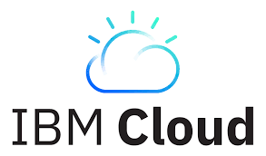 

 

  

# Introducción 

¿Qué es IBM Cloud? ¿Cómo surgió? ¿Para qué se utiliza? ¿Cómo se diferencia de otras plataformas similares cómo AWS, Azure y Google Cloud?  

En esta sección intentaremos responder a estas preguntas, dando un marco teórico a los laboratorios que siguen. 

En 2014, IBM lanzó Bluemix (hoy IBM Cloud): una plataforma que ofrece servicios a través de la red. En esta plataforma, el usuario puede acceder a tres tipos de servicios: infrastructure as a service (IaaS), software as a service (SaaS) y platform as a service (PaaS), pagando únicamente por los recursos que consume. la principal diferencia entre estos servicios es la cantidad de interacción que se tiene con el hardware:  

 

  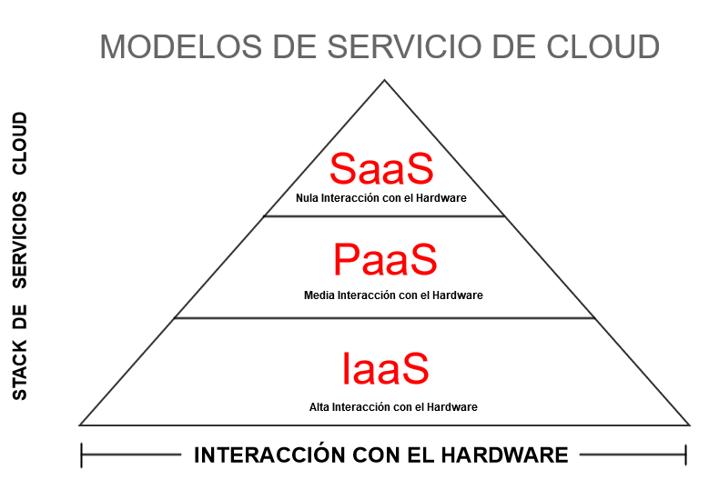 

 

Si bien la computación en la nube tiene varias desventajas cómo la extrema centralización de los recursos y la dependencia de la conexión a internet, estas limitantes son ampliamente superadas por la escalabilidad, seguridad, fiabilidad y flexibilidad que ofrece esta plataforma.  

Los servicios ofrecidos por la plataforma IBM Cloud se pueden dividir en las siguientes categorias: 

* **Computo**: bare-metal servers, virtual servers, serverless computing, contenedores. 

* **Network**: content delivery network (CDN), virtual private network (VPN) tunnels and firewalls; 

* **Almacenamiento**. 

* **Seguridad**:  Servicios de seguimiento de actividad e identidad . 

* **Manejo de Datos** : Bases de datos SQL y NoSQL. Migraciones. 

* **Analytics**: Data science (Apache),  IBM Watson Machine Learning. 

* **Inteligencia Artificial**: IBM Watson: Machine learning, natural language processing and visual recognition. 

* **Internet of things (IoT)**:  IBM IoT Platform. 

* **Developer tools**: CLI, continuous delivery, pipelines. 

* **Blockchain**:  IBM's Blockchain Platform. 

* **Integration**:  API Connect, App Connect and IBM Secure Gateway. 

* **Migration** :  IBM Lift CLI, Cloud Mass Data Migration. 

*Bottom line:* 

El concepto de **computación en la nube** hace referencia al “suministro de recursos informáticos flexibles y a petición, desde aplicaciones hasta centros de datos, a través de Internet y con un modelo de pago según uso.” (ref: https://www.ibm.com/es-es/cloud/learn/cloud-computing).  

Las clouds flexibilizan, automatizan y simplifican una enorme cantidad de procedimientos que anteriormente debían ser gestionados internamente. El concepto de computación en la nube fue introducido en los 70’ por John McCarthy, sin embargo, la primera nube de uso masivo: AWS, fue lanzada por Amazon en 2006. La nube de IBM, lanzada 8 años después, capta el 8% del cloud computing mundial. 

# Descripción 

El objetivo general de este dojo es familiarizar al lector con los conceptos fundamentales de la nube de IBM y poner en marcha algunas de las herramientas más sencillas y útiles de esta plataforma. 

Se realizarán cuatro laboratorios para poner en práctica estos conceptos y verificar la utilidad de la plataforma IBM Cloud.  

En el laboratorio 0 se hará un “reconocimiento de terreno” para comenzar a entender la plataforma y los servicios que ofrece. El laboratorio 1 consiste en desplegar una aplicación utilizando Cloud Foundry. En el laboratorio 2, se creará una aplicación utilizando el servicio: “Continuous delivery toolchain”. En el último laboratorio, se estudiará el uso del IBM Cloud Command Line Interface para manejar un servicio de la nube.   

# Laboratorio 0: Descubriendo IBM Cloud 

Antes de empezar a utilizar los servicios que ofrece IBM Cloud es necesario abrir una cuenta.  

Crear una cuenta no tiene costo y es muy sencillo: 

* Entre a  https://cloud.ibm.com 

 

   

 

* Cree su cuenta accediendo a "Create an IBM Cloud account" y complete los datos personales. 

 

  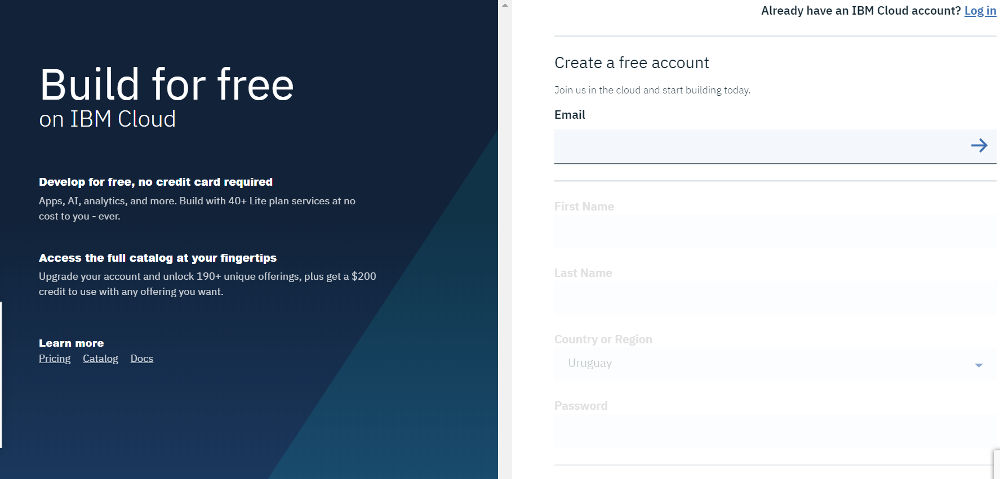 

 

* Recibirá un mail a la dirección de correo indicada anteriormente donde deberá realizar la confirmación de la cuenta. 

 

   

 

 

*  Una vez hecha la verificación, inicie sesión.  

 

   

 

* Lo primero que verá una vez iniciada la sesión será un Dashboard. 

 

  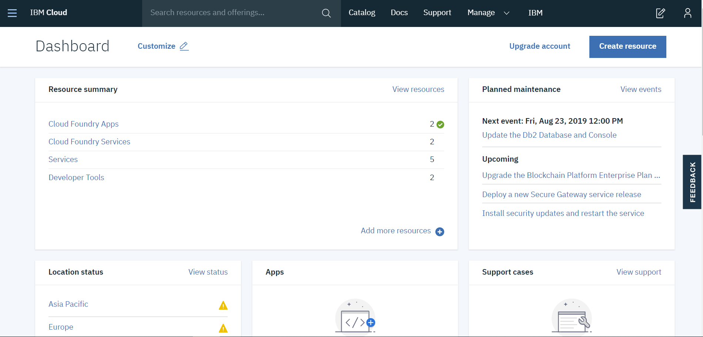 

 

Cada usuario de IBM Cloud puede personalizar su dashboard. Por defecto, allí encontraremos los siguientes elementos: 

**Resource summary**:  donde podrás visualizar los recursos que actualmente estás utilizando 

**Planned maintenance**: donde se podrá ver los eventos de mantenimiento planificados 

**Location status**: donde se puede ver el estado de los data centres por continente. Si actualmente hay algun problema , ya sea en mantenimiento o investigación, se podrá ver una alerta. Si no, verá un tick verde al lado del nombre del continente. 

**Apps**: donde se ven el historial de apps creadas. 

**Support cases**: donde podrás encontrar un resumen de los casos de soporte actualmente abiertos. 

**Usage**, donde encontrarás un historial del uso de tu cuenta en IBM Cloud 

**User access**: donde se ven listados los usuarios que tienen acceso a esta cuenta. 

**Learn**: donde podrá acceder a tutoriales e información general acerca de IBM Cloud. 

 

Una sección esencial dentro de la página IBM Cloud es el Catálogo.  

Allí podremos encontrar todos los servicios que ofrece la nube, separadas en categorías.  

Cada servicio tiene cuatro posibles etiquetas: 

**Lite**: refiere a servicios que tienen una opción de prueba gratuita. 

**IBM**: refiere a servicios propios de IBM 

**Community**: refieren a los servicios de la comunidad, externos a IBM 

**IAM enabled**: refieren a los servicios que siguen el protocolo IAM autentificación y control de acceso a los recursos en la nube. (IAM = Identity and Access Management). (Para comprender en profundidad el funcionamiento del servicio IAM visitar el siguiente link: https://cloud.ibm.com/docs/iam?topic=iam-userroles&locale=en-us.) 

 

  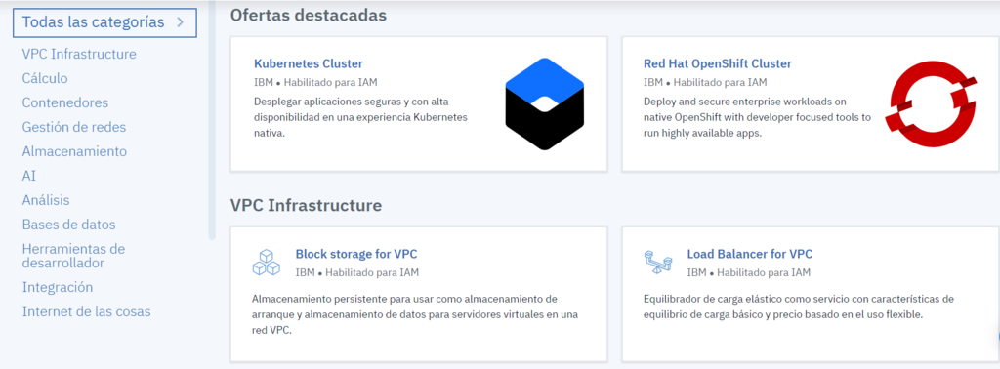 

 

Desde el menú superior también se puede a acceder a las secciones: **Support** y **Docs**. En support se encuentran las FAQs y las soluciones a los problemas más típicos mientras que en Docs está la documentación de la IBM Cloud, acompañada de algunos tutoriales y guías para poner en marcha algunos servicios básicos. 

Una pequeño resumen de lo que vimos hasta ahora: https://www.youtube.com/watch?v=VXqbRNwXC2A. 

# **IMPORTANTE**: Los siguientes laboratorios son guías detalladas: un paso a paso de algunas funcionalidades simples disponibles en IBM Cloud. Es de vital importancia que **NO** siga ciegamente las instrucciones. Salga del camino, explore desviaciones, equivóquese, borre todo, vuelva a comenzar y vaya hasta el fondo en los conceptos.  

 

Corto video introductorio al desarrollo en la nube: https://www.youtube.com/watch?time_continue=52&v=Bsy6mhRc7ZA 

# Laboratorio 1: Crear una aplicación a partir de un *application starter*. 

 En esta sección veremos cómo crear una aplicación utilizando Cloud Foundry siguiendo estos pasos: 

En primer lugar, acceder al Catálogo de servicios de IBM Cloud y elegir uno de los servicios de Cloud Foundry. En este caso utilizaremos Liberty for Java. 

Al hacer click en esta, verá un formulario del estilo 

 

  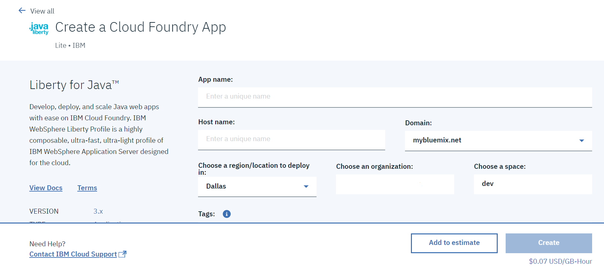 

 

Deberá proveer un nombre para su aplicación, que por defecto también se va a asignar como Host name. Como esta debe ser única, se recomienda agregarle al nombre de la aplicación tus iniciales o el nombre de la empresa acompañado de la fecha de creación de esta. 

Además, se recomienda también que la memoria sea de 256 ya que puede que algunos ejecutables no funcionen con menos cantidad de memoria. 

 

Al apretar el botón Create, se despliega un dashboard con información acerca de la aplicación. 

 En la sección Getting Started podremos seguir la guía paso a paso proporcionada o directamente descargar el código de nuestra aplicación.  

En Runtime podremos ver la cantidad de instancias actualmente creadas y la cantidad de memoria utilizada por instancia, pudiendo aumentar y disminuir las cantidades en ambos casos. 

 Además, la sección Logs te da la posibilidad de ver los mensajes mientras la aplicación se va armando, permitiendo así entender en caso de error. 

 Una vez que la aplicación ya está andando (pasó del estado Starting a Running) se habilitará la opción Visit App URL donde podremos acceder a nuestra aplicación. 

 

  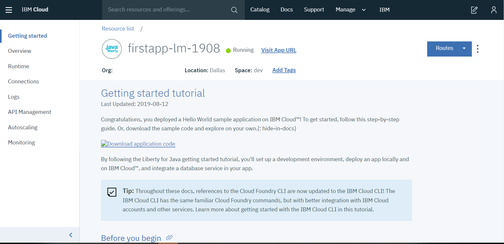 

 

 

 

  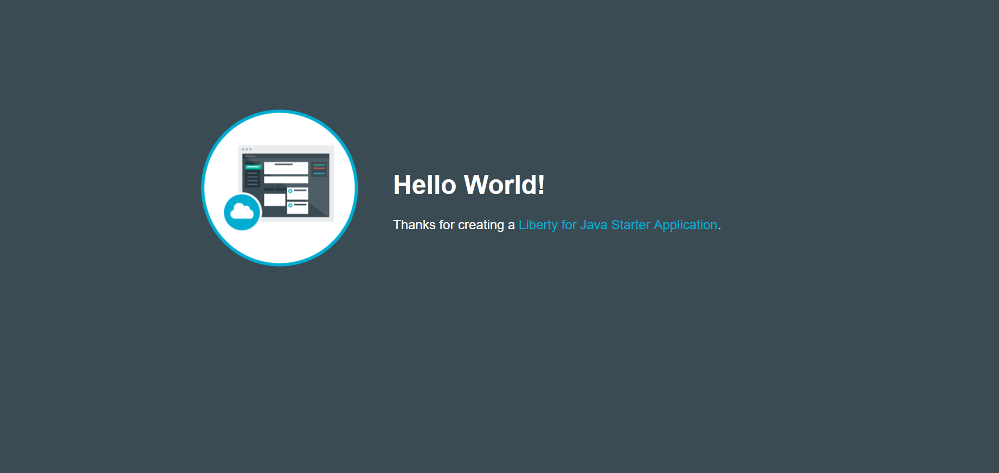 

 

 

 

# Laboratorio 2: Crear una aplicación utilizando *IBM Cloud Continuous Delivery Toolchains* 

En esta sección veremos cómo crear una aplicación utilizando IBM Cloud Continuous Delivery Toolchains a partir de un repositorio de GitHub ya existente. Utilizaremos como ejemplo una aplicación construida en NodeJS la cual utiliza una base de datos Cloudant NoSQL para organizar archivos. 

Primero, debemos acceder al repositorio http://github.com/ibmecod/nodejs-cloudant. 

 

  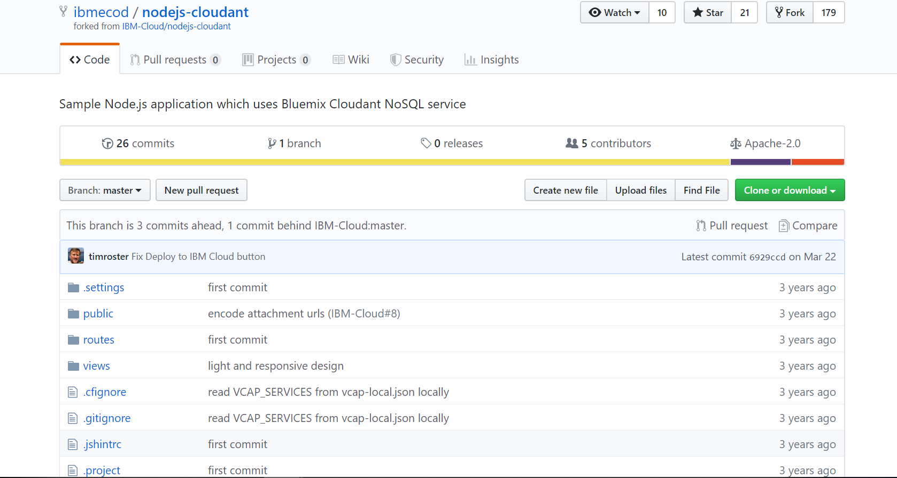 

 

Haciendo click en el botón Deploy to IBM Cloud se va a crear automáticamente en el entorno de IBM Cloud. 

 

  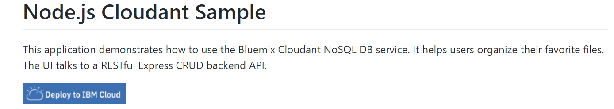 

 

 

 

  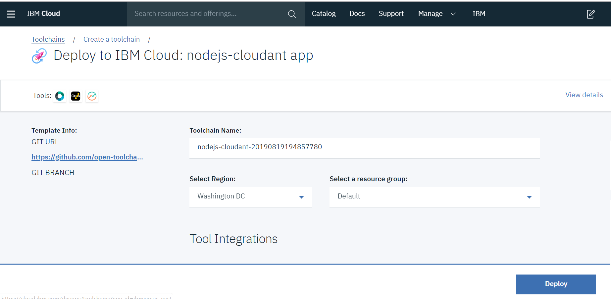 

 

Luego debemos seleccionar la opción Delivery Pipeline de las herramientas de Integración 

 

 

   

 

Dentro de Delivery Pipeline debemos llenar los siguientes campos 

 

  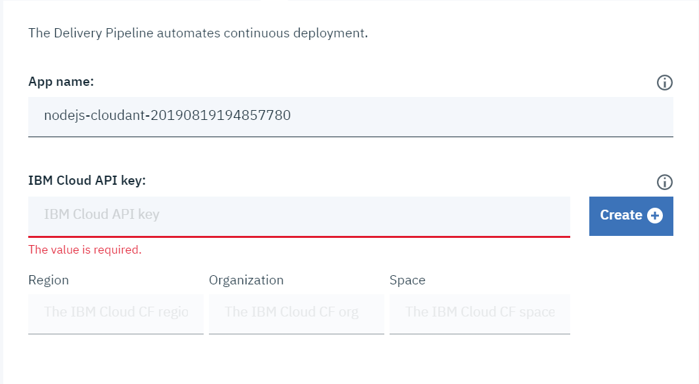 

 

 

Si no contamos con una IBM Cloud API key, debemos hacer click en el botón Create la cual nos creará una API key automáticamente. 

 

  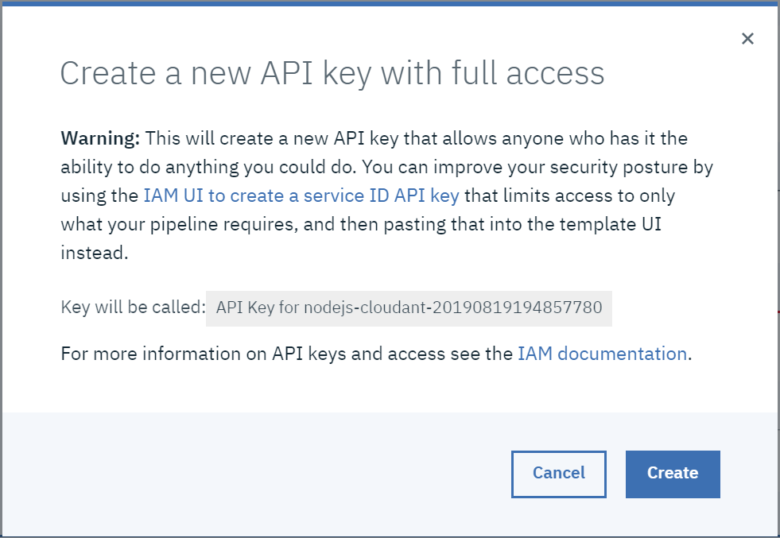 

 

Finalmente, hacemos click en el botón Deploy 

 

 

  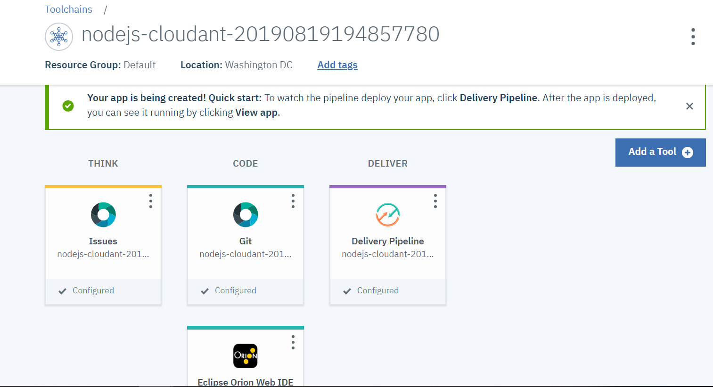 

 

Una vez allí, seleccionamos el icono de Delivery Pipeline y una vez que finalice la Deploy Stage (estado: Stage Passed), tendremos el link para acceder a nuestra aplicación 

 

 

  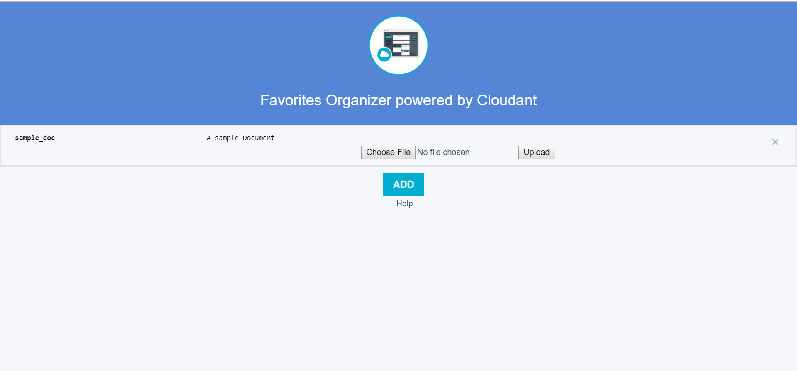 

 

 

 

# Laboratorio 3: Manejar un servicio a través de IBM Command Line Interface 

A continuación, se detallan los simples pasos que hay que seguir para desplegar una aplicación desde la terminal. 

Descargar el repositorio de la aplicación de ejemplo a través del siguiente link  http://github.com/ibmecod/nodejs-cloudant y guardarlo en una nueva carpeta. 

 

Abrir una terminal y navegar hasta la carpeta con los archivos de la aplicación de ejemplo. 

 

Ingrese a su usuario con el comando "ibmcloud login -a https://api.ng.bluemix.net". 

 

Cree un instancia del servicio "Cloudant Database" con el comando imbcloud service offerings".  

 

Cree una instancia del "Cloudant NoSQL database" con el comando: "ibmcloud service create cloudantNoSQLDB Lite myCloudantDB"  

 

Haga un "push" a la nube de su aplicación con el siguiente comando: "ibmcloud app push favapp-tor-0517 -c "node app.js" -m 128M --no-manifest --no-start" 

 

 Bind el servicio a la aplicación: "ibmcloud service bind favapp-tor-0517 myCloudantDB" 

 

 Lance la aplicación: "bx app start favapp-tor-0517" 

 

 

 

 

 

 

 

  

  

  

  

 

 
